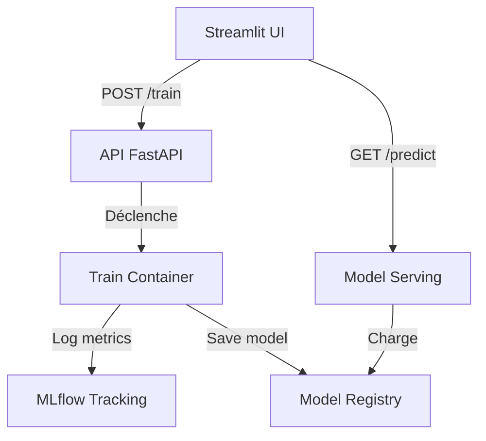

# MLflow Model Management System


## 📋 Description
Système complet de gestion de modèles ML avec :
- Entraînement via API
- Tracking des expériences
- Serving des modèles
- Interface Streamlit

## 🛠️ Technologies
- **MLflow** : Tracking et registry
- **FastAPI** : API d'entraînement
- **Streamlit** : Interface utilisateur
- **Docker** : Conteneurisation
- **Scikit-learn** : Modèles ML

## 🏗️ Architecture

```bash
project-mlflow/
├── data/                          # Données d'entraînement (locales)
├── frontend/                      # Interface utilisateur Streamlit
│   └── pages/                     # Pages Streamlit (train, predict)
├── serving/                       # Modèles déployés avec MLflow
│   ├── mlruns/                    # Logs MLflow (tracking + modèles)
│   └── models/                    # Registry de modèles sauvegardés
├── training/                      # Code d'entraînement et API
│   ├── train.py                   # Script d'entraînement principal
│   └── api_train.py               # API FastAPI
├── docker-compose.yml            # Déploiement multi-services
└── README.md
```



## Mise en marche 
```bash
git clone https://github.com/votre-repo/mlflow-system.git
cd mlflow-system
docker compose up --build
```